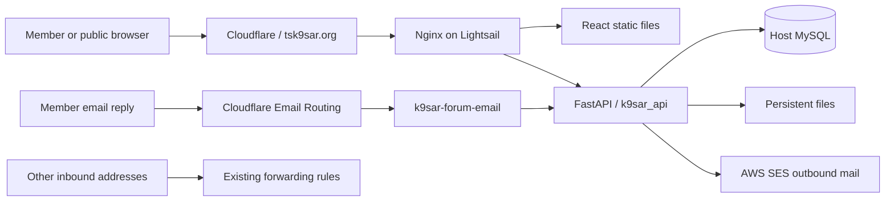

# K9SAR maintenance and handoff guide

**Last technical verification: 2026-10-05.** This guide covers maintenance,
onboarding and recovery for [tsk9sar.org](https://tsk9sar.org): frontend, backend,
database, files, hosting, authentication and email. It contains no secret values.

The canonical editable copy is `docs/MAINTENANCE_AND_HANDOFF.md` in the
[frontend repository](https://github.com/TSK9SAR/k9sar_frontend). A standalone copy
is supplied at `C:\dev\K9SAR_Maintenance_and_Handoff.md`; refresh it after editing
this guide. The backend README and handoff pointer link here. Keep instructions
in Git so a successor can work without this Codex conversation. Service access
and private configuration must be transferred separately.

## Contents

1. [First hour and system map](#first-hour-and-system-map)
2. [People and access](#people-and-access)
3. [Code and configuration](#code-and-configuration)
4. [Development and checks](#development-and-checks)
5. [Deployment and rollback](#deployment-and-rollback)
6. [Backups and recovery](#backups-and-recovery)
7. [Routine maintenance and troubleshooting](#routine-maintenance-and-troubleshooting)
8. [Known gaps and priorities](#known-gaps-and-priorities)
9. [Handoff acceptance](#handoff-acceptance)

## First hour and system map

Start with the [ownership register](https://github.com/TSK9SAR/k9sar_frontend/blob/main/docs/K9SAR_System_Status_and_Ownership.md).
Confirm the owner, your access and the current release before making changes.
Clone both repositories, read their `AGENTS.md` instructions and perform the
read-only checks below. Develop on a separate branch or worktree. A fresh clone
is preferable to inheriting a workstation with credentials and unrelated files.

| Component | Verified location / behavior |
| --- | --- |
| Frontend source | `TSK9SAR/k9sar_frontend`, `main`; owner checkout `C:\dev\k9sar_frontend` |
| Backend source | `TSK9SAR/k9sar_backend`, `main`; host checkout `/home/ubuntu/k9sar_backend` |
| Website | `https://tsk9sar.org`; React SPA at `/` |
| API | `https://tsk9sar.org/api/`; FastAPI, Python 3.11 container |
| API schema / docs | `/api/openapi.json` and `/api/docs` |
| Host | AWS Lightsail, Ubuntu 22.04.5 LTS; timezone UTC |
| Reverse proxy | Host Nginx; `/etc/nginx/sites-enabled/sark9s.org` links to `/etc/nginx/sites-available/sark9s.org` |
| Backend process | Docker `k9sar_api`; restart `unless-stopped`; bridge network; host port 8000 |
| Database | Host MySQL 8.0.46, schema `k9sar`; container connects to `172.17.0.1:3306` |
| Browser assets | `/var/www/k9sar_frontend` |
| Outbound email | SES SMTP at `email-smtp.us-east-2.amazonaws.com:587`, STARTTLS; From `no-reply@tsk9sar.org` |
| Inbound forum email | Cloudflare Email Routing -> Worker `k9sar-forum-email` -> `/api/forums/inbound-email` |



On the owner's Windows workstation, the existing connection is:

```powershell
ssh -F C:/dev/k9sar_frontend/.ssh_config_codex k9sar
```

A successor should obtain an individual SSH key and current host details from
the administrator. This local configuration/private key is not a portable project
dependency and must not be committed.

Read-only checks **on the server**:

```bash
docker ps --format 'table {{.Names}}\t{{.Status}}\t{{.Ports}}'
curl -fsS http://127.0.0.1:8000/health
sudo systemctl is-active nginx mysql
sudo nginx -t
df -h
git -C /home/ubuntu/k9sar_backend status --short
git -C /home/ubuntu/k9sar_backend rev-parse HEAD
```

Expect JSON with `status: ok` from local health. This confirms the process, not
every dependency. **Public `/health` falls through to the SPA and is not an API
health check.** Check the public site and `/api/openapi.json`, then an authorized
application workflow. Some automated clients encounter Cloudflare filtering;
distinguish this from origin failure.

Nginx preserves `/api/` when proxying to port 8000, proxies `/verify/`, redirects
legacy `/app/...` URLs to `/...`, and supplies SPA fallback routing. Old
`sark9s.org` configuration and certificate directory names do not determine the
current domain; the active `server_name` is `tsk9sar.org`.

## People and access

The existing record names **Beat Marti**, `beatmarti@gmail.com`, as owner and
technical administrator. Backup administrator, emergency contact and backup/
restore owner remain unassigned. Confirm these details during handoff. Account
membership, billing, MFA recovery and registrar ownership were not independently
verified through SSH.

Arrange individual access to GitHub, AWS Lightsail/SES/S3, Cloudflare DNS/Workers/
Email Routing, Linux, production app administration and active Google/Microsoft
OAuth registrations. Keep vault references and recovery codes in a protected
operational register. Test an alternate administrator's access. Repository access
does not grant access to hosting, secrets, the database or member administration.

## Code and configuration

### Source map

| Area | Frontend | Backend |
| --- | --- | --- |
| Entry / routing | `index.html`, `src/main.jsx`, `src/layouts/AppLayout*` | `app/main.py`; registrations establish actual route prefixes |
| API / persistence | `src/lib/api.ts`, `src/utils/apiBase.ts` | `app/routes/`, `app/schemas/`, `app/models/`, `app/database.py` |
| Authentication | Auth/MFA components and route guards | `auth_routes.py`, `twofa_routes.py`, `webauthn_routes.py`, `oauth_routes.py`, `app/security/` |
| Members / handlers / dogs / teams | Corresponding `src/pages/` and `src/pages/admin/` modules | Corresponding route/model modules; user accounts and handler/member/team records are distinct |
| Standards / certifications / ID cards | Matrix, standards, certificate pages and card components | `standard_routes.py`, `certification_routes.py`, `id_cards.py`, public verification routes |
| Forums / surveys | `Forum*Page.jsx`, `components/forums/`, admin survey page | `forum.py`, `admin_forum_surveys.py`, forum models/services |
| Files / signatures | Upload and attachment UI | `documents.py`, `stored_files.py`, `admin_stored_files.py`, `signature_routes.py` |
| Mail / recovery links | Invite/reset/email-entry pages | `app/services/mailer.py`, `links.py`, notifications and invite/reset routes |
| Email replies | Existing forum displays the resulting post | `forum_inbound_email.py`, `forum_email_replies.py`, `cloudflare/forum-email/` |

The older `src/App.tsx` is not the configured browser entry. Follow actual imports
before editing similarly named modules. `apiJson` returns parsed JSON;
`apiFetch` returns a `Response`. The shared wrapper attaches bearer tokens and
handles expiry. Some callers use direct same-origin `/api/...` paths.

Frontend guards are a convenience. Enforce role, affiliation, ownership, MFA and
forum permissions in the backend. Preserve preview/confirm flows for destructive
administration. Consult the [frontend API inventory](https://github.com/TSK9SAR/k9sar_frontend/blob/main/docs/API_REFERENCE.md)
for callers and running OpenAPI for schemas. Some routes declare their own
prefixes; do not blindly prepend a second `/api`.

### Runtime settings

Production Docker loads `/home/ubuntu/k9sar_backend/backend.env` with `--env-file`.
The database module additionally loads `backend.env`, then `.env`, without
overriding existing process variables. **Edit the active `backend.env`, not just
`.env`. Restarting a container does not reload `--env-file`; recreate it with
the reviewed file and the same persistent mounts.**

| Setting(s) | Meaning / maintenance implications |
| --- | --- |
| `DATABASE_URL` | Actual SQLAlchemy connection. `DB_*` also exist; keep dependent tools consistent. Never use production credentials in local experiments. |
| `JWT_SECRET`, `JWT_ALGORITHM`, token lifetimes | Login token signing; rotation can invalidate sessions. Check legacy JWT helper fallbacks before refactoring. |
| `FERNET_KEY` | Encryption key for stored application secrets. Preserve the matching key with recoverable data; replacement without migration can make values unreadable. |
| `PUBLIC_BASE_URL` | Currently `https://tsk9sar.org`, used in external links. |
| `FRONTEND_BASENAME` | Link service defaults to `/app` when unset; existing Nginx redirects support it. Coordinate link/routing changes. |
| `SMTP_HOST`, `SMTP_PORT`, `SMTP_USER`, `SMTP_PASS`, `SMTP_FROM`, `SMTP_TLS`, `SMTP_SSL` | SES outbound mail; current From `no-reply@tsk9sar.org`. |
| `FORUM_EMAIL_REPLIES_ENABLED` | Currently `true`; controls reply addresses and inbound processing. |
| `FORUM_REPLY_DOMAIN` | Currently `tsk9sar.org`. |
| `FORUM_REPLY_SECRET` | Backend-only signing key; rotation revokes outstanding reply addresses. |
| `FORUM_INBOUND_SECRET` | Must match in backend and Worker. Coordinate rotation; a mismatch rejects replies. |
| `FORUM_LINK_SECRET` | Separate website email-entry signing; not the inbound shared secret or reply signing key. |
| `WEBAUTHN_ORIGIN`, `WEBAUTHN_RP_ID`, `WEBAUTHN_RP_NAME` | Passkey origin/relying-party settings; domain changes may affect existing credentials. |
| `GOOGLE_*`, `MICROSOFT_*`, `OAUTH_REDIRECT_URI` | Identity app credentials/callbacks. Configured presence does not prove all paths are in use. |
| `AWS_*` | Application AWS settings; the host backup CLI may use different credentials. Verify both. |
| `STORED_FILE_ROOT`, `STORED_FILE_MAX_BYTES` | File storage/limits; current root `/app/uploads/files`. |
| `VIDEO_SIGNING_SECRET` | Help-video signing. Source has an insecure fallback and this variable was absent from the inspected container environment; reconcile actual playback/proxy behavior before changing it. |
| `VITE_API_BASE_URL`, `VITE_BUILD_ID` | Public build-time browser settings; production API `/api`. Use the commit as build ID and rebuild to change values. |

Never put secrets in `VITE_*`. Environment files are Git-ignored, but there is no
backend `.dockerignore`: ordinary `docker build .` can copy ignored secrets into
an image. The release recipe below uses tracked Git content. Treat older images
and server archives as potentially containing credentials and keep them private.

### Persistent storage

| Host path | Container / serving path | Recovery treatment |
| --- | --- | --- |
| `/var/k9sar/uploads` | `/app/uploads`, including stored files | Preserve across containers; restore with related DB records |
| `/var/www/k9sar_signatures` | Same path in container | Separate persistent bind mount |
| `/var/sark9/private_videos` | Same path in container; Nginx internal `/_protected_videos/` | Preserve media and signing/access configuration |
| `/var/www/k9sar_frontend` | Nginx SPA and `/assets/` | Rebuildable; retain previous release for rollback |
| `/var/www/k9sar_static` | Nginx `/static/` | Inventory/back up assets not reproducible from Git |
| `/var/www/k9sar_public` | Included in manual server archive | Inventory legacy content before retiring it |
| `/var/www/k9sar_pdfs` | Nginx `/pdfs/` reference, directory absent at audit | Check dependencies before relying on this legacy path |

The database is host MySQL, not the Compose database. Restore a consistent logical
backup or suitable snapshot; copying a live MySQL data directory is not a backup.

## Development and checks

### Frontend

Use `package-lock.json` with `npm ci`. Audit environment: Node 24.12.0, npm 11.17.0,
installed Vite 7.3.2. Its engine requirement is `^20.19.0 || >=22.12.0`; select a
supported runtime and record the version.

```powershell
git clone https://github.com/TSK9SAR/k9sar_frontend.git
Set-Location k9sar_frontend
npm.cmd ci
npm.cmd run dev
npm.cmd run build
npm.cmd run lint
```

The current Vite configuration has no API proxy. The owner's `.env` contains a
legacy absolute API address; do not copy it. For an isolated backend on local port
8000, set `.env.local` to `VITE_API_BASE_URL=/api` and add this development-only
property inside the existing `defineConfig({...})`:

```js
server: {
  proxy: {
    "/api": { target: "http://127.0.0.1:8000", changeOrigin: true },
    "/verify": { target: "http://127.0.0.1:8000", changeOrigin: true },
    "/signatures": { target: "http://127.0.0.1:8000", changeOrigin: true },
  },
},
```

This is a suggested setup, not an installed change. Additional media/static paths
may need a local reverse proxy. `npm run preview` serves the built frontend; it
does not provide a backend or reproduce Nginx.

### Backend

Use Linux/WSL or isolated Docker with Python 3.11 and MySQL 8. Dependencies are
partly unpinned; record resolved versions when validating changes.

```bash
git clone https://github.com/TSK9SAR/k9sar_backend.git
cd k9sar_backend
python3.11 -m venv .venv
source .venv/bin/activate
python -m pip install -r requirements.txt
```

Create a development-only `backend.env` with an isolated DB/user, independent
signing/encryption keys and local public URLs. Configure a local mail sink instead
of production SES. Agree on sanitized fixtures for roles, members, standards and
affiliations; no complete one-command bootstrap/seed process was verified.
Then run `uvicorn app.main:app --host 127.0.0.1 --port 8000 --reload`.

**Importing `app.database` or `app.main` connects to the DB and runs
`Base.metadata.create_all`.** Import-based probes can create tables. `create_all`
creates missing tables; it does not migrate existing columns. Alembic is installed
as a dependency, but no configured migration directory or `alembic.ini` was found.
Review explicit schema changes and recovery before release.

`docker_compose.yml` describes a different container/database layout and includes
development credential defaults. Adapt it for an isolated environment; do not use
it to replace production.

### Tests and release acceptance

Run backend forum tests in an isolated copy with its dependencies:

```bash
python -m unittest discover -s tests -p 'test_forum_email*.py' -v
```

These tests inject SQLite before production database imports and mock notification
delivery. Do not generalize that isolation to arbitrary future tests/imports.
Worker tests, from the backend repo:

```bash
node --test cloudflare/forum-email/worker.test.mjs
cd cloudflare/forum-email
npm install --no-save miniflare
node --test worker.test.mjs worker.runtime.test.mjs
```

Alternatively set `MINIFLARE_MODULE` to an installed package directory. Keep the
workerd runtime test: Node-only tests missed a previous fetch incompatibility.
Install test dependencies in the test workspace, not the live backend container.

| Verification | Evidence / limitation |
| --- | --- |
| Frontend build | Passed 2026-10-05 with installed dependencies; fresh `npm ci` not repeated in this audit |
| Frontend lint | 16 existing errors, 5 warnings; JS/JSX only, no full TypeScript lint/typecheck or frontend test script |
| Backend forum tests | 16 passed during forum release verification, 2026-10-04 |
| Worker tests | 7 Node tests and 1 workerd test passed during that verification |
| Real email reply | Owner confirmed successful end-to-end posting before the backend commit |
| API/site | Local JSON health/OpenAPI pass; public site and OpenAPI HTTP 200 on 2026-10-05 |
| Backups | Latest local DB/upload gzip checks pass; latest DB object in S3; full restore not performed |

For releases, test affected workflows with designated accounts/data: login, expiry,
MFA/passkeys when changed, member/handler/dog/team views, standards/certifications,
ID cards and public verification, uploads, admin restrictions and forum permissions/
notifications/replies. Do not send test campaigns to real members. Record baseline
lint findings separately from regressions. No checked-in CI workflow was found.

## Deployment and rollback

These are operator procedures, **not deployments performed by this documentation
update**. Verify current topology, disk space, usable backups and the change
window. Record revisions, config/schema changes, checks and rollback references.

### Frontend

Build locally; upload only artifacts. Legacy `sync-frontend` scripts copy source
trees and may include environment files. From the Windows frontend checkout:

```powershell
git status --short
$releaseCommit = (git rev-parse --short=12 HEAD).Trim()
$releaseId = "$releaseCommit-$(Get-Date -Format yyyyMMdd-HHmmss)"
$env:VITE_API_BASE_URL = '/api'
$env:VITE_BUILD_ID = $releaseCommit
npm.cmd ci
if ($LASTEXITCODE -ne 0) { throw 'Dependency installation failed' }
npm.cmd run build
if ($LASTEXITCODE -ne 0) { throw 'Build failed' }
$releaseArchive = Join-Path $env:TEMP "k9sar_frontend-$releaseId.tgz"
tar.exe -czf $releaseArchive -C dist .
if ($LASTEXITCODE -ne 0) { throw 'Packaging failed' }
scp -F C:/dev/k9sar_frontend/.ssh_config_codex $releaseArchive k9sar:~/
if ($LASTEXITCODE -ne 0) { throw 'Upload failed' }
Write-Output "Release ID: $releaseId"
```

Commit intended source changes first and inspect local build overrides. Do not
label an uncommitted build as an exact commit. Substitute the printed release ID
below, **on the server**:

```bash
set -euo pipefail
release_id='REPLACE_WITH_PRINTED_RELEASE_ID'
[[ "$release_id" =~ ^[0-9a-f]{12}-[0-9]{8}-[0-9]{6}$ ]]
stage="$HOME/k9sar_frontend_releases/$release_id"
backup="$HOME/k9sar_frontend_backups/k9sar_frontend_$release_id"
test ! -e "$stage"
test ! -e "$backup"
mkdir -p "$stage" "$backup"
tar -xzf "$HOME/k9sar_frontend-$release_id.tgz" -C "$stage"
test -f "$stage/index.html"
sudo rsync -a /var/www/k9sar_frontend/ "$backup/"
sudo nginx -t
sudo rsync -a --delete "$stage/" /var/www/k9sar_frontend/
sudo chown -R www-data:www-data /var/www/k9sar_frontend
sudo systemctl reload nginx
printf 'Previous frontend saved at %s\n' "$backup"
```

Test a browser deep-link refresh and the release ID. Open tabs may request old
hashed chunks removed by promotion; watch asset 404s. A future atomic release/
asset-retention strategy would improve this. The current repo redeploy script's
backup block is commented out despite its success message; take the explicit
backup above.

Frontend rollback, using the actual saved directory:

```bash
set -euo pipefail
backup="$HOME/k9sar_frontend_backups/REPLACE_WITH_ACTUAL_BACKUP_DIRECTORY"
test -f "$backup/index.html"
sudo nginx -t
sudo rsync -a --delete "$backup/" /var/www/k9sar_frontend/
sudo chown -R www-data:www-data /var/www/k9sar_frontend
sudo systemctl reload nginx
```

### Backend

Use a clean checkout at a reviewed revision. This **Bash** recipe builds before
stopping the live container and excludes untracked secrets using `git archive`.
Do not run the binary pipe through Windows PowerShell 5.1. Back up first and plan
schema/config changes; this causes a brief interruption.

```bash
set -euo pipefail
cd /home/ubuntu/k9sar_backend
test -z "$(git status --porcelain)"
revision="$(git rev-parse HEAD)"
stamp="$(date -u +%Y%m%d-%H%M%S)"
image="k9sar_backend:${revision:0:12}-$stamp"
previous="k9sar_api_before_$stamp"
test -f backend.env
git archive "$revision" | docker build --label "org.opencontainers.image.revision=$revision" -t "$image" -
docker run --rm --network none --entrypoint python "$image" -m unittest discover -s tests -p 'test_forum_email*.py' -v
docker stop k9sar_api
docker rename k9sar_api "$previous"
docker run -d --name k9sar_api --restart unless-stopped \
  --env-file /home/ubuntu/k9sar_backend/backend.env \
  -p 8000:8000 \
  -v /var/k9sar/uploads:/app/uploads \
  -v /var/www/k9sar_signatures:/var/www/k9sar_signatures \
  -v /var/sark9/private_videos:/var/sark9/private_videos \
  "$image"
printf 'Rollback container: %s\n' "$previous"
```

If startup fails, recover immediately with the previous container. Allow startup
time, inspect `docker logs --tail 100 k9sar_api` privately, repeat local JSON health
and test public/API workflows. Keep the previous stopped container/image until
acceptance. It retains its previous environment even if `backend.env` changed.
Never paste unrestricted Docker inspect output into a PR.

Backend rollback, substituting the recorded previous name:

```bash
set -euo pipefail
previous='REPLACE_WITH_RECORDED_PREVIOUS_CONTAINER'
docker inspect --format '{{.Name}} {{.State.Status}}' "$previous"
if docker container inspect k9sar_api >/dev/null 2>&1; then
  docker stop k9sar_api
  docker rename k9sar_api "k9sar_api_failed_$(date -u +%Y%m%d-%H%M%S)"
fi
docker rename "$previous" k9sar_api
docker start k9sar_api
```

Code rollback does not reverse schema/data changes. Review old-image compatibility
and a forward fix or explicit data recovery plan before migrations. Retain forum
email receipts: deleting them can allow replay of a previously moderated post.

The root and `scripts/` versions of `redeploy_backend.sh` disagree on mounts and
stop/remove the container before building. The root version omits live signature/
video mounts. Do not run either blindly. Verify any new service definition against
the live network, restart policy, mounts, environment and firewall.

### Forum email Worker

Use committed `cloudflare/forum-email/` source and the
[component guide](https://github.com/TSK9SAR/k9sar_backend/blob/main/docs/forum-email-replies.md).

```bash
cd cloudflare/forum-email
npx wrangler login
npx wrangler deploy
# Only when setting or rotating the shared credential:
npx wrangler secret put FORUM_INBOUND_SECRET
```

Record Wrangler/deployed Worker versions. Paste only the matching backend secret
at the prompt. `FORUM_REPLY_SECRET` stays exclusively on the backend. For a new
Worker, deploy before adding the secret, then activate the route after both sides
are ready. For existing releases, verify retained secrets/routes.

The route is **`forum@tsk9sar.org` -> `k9sar-forum-email`**, with subaddressing
enabled for `forum+token@tsk9sar.org`. Preserve `info`, no-reply and catch-all
forwarding. `wrangler.toml` intentionally omits address/route management.

Replies create text-only comments on existing topics. Tokens last 30 days, bind
to user/topic/current email, and require matching sender and current permissions.
The backend does not independently verify DKIM/DMARC. Only MIME `text/plain` is
accepted; HTML/attachments are ignored and HTML-only/automated messages rejected.
Top-post above quoted history. Limits: 1 MiB MIME, 20 KiB UTF-8 text. Website links
remain. Post/receipt commit together; duplicate deliveries do not create posts.
Notifications run after commit and may be lost if the process crashes then; there
is no durable notification queue.

Keep `redirect: "manual"` and reject redirects: `redirect: "error"` failed in
workerd despite passing Node tests. Do not log reply addresses, MIME bodies or
credentials. Run the runtime test after Worker network changes.

Emergency disable: set `FORUM_EMAIL_REPLIES_ENABLED=false` in `backend.env` and
recreate the backend with existing mounts. This rejects replies from old emails
too. Preserve normal forwarding. For Worker regressions, redeploy a reviewed prior
source/version and check shared-secret compatibility. Record the previous Worker
version before each release.

## Backups and recovery

### What actually runs

Installed host executables differ from the repository scripts. Installed scripts,
root cron, archive files and S3 listing were checked on 2026-10-05:

| Data | Installed command / schedule | Destination / retention |
| --- | --- | --- |
| MySQL `k9sar` | `/usr/local/bin/k9sar-backup-now`; daily **02:00 UTC**, root cron | `/var/backups/k9sar-mysql/*.sql.gz`; local cleanup after 7 days; copy to `s3://k9sar-prod-backups-817557336343-usw2/k9sar/mysql/` |
| Uploads | `/usr/local/bin/k9sar-uploads-backup`; Sunday **03:15 UTC**, root cron | `/var/backups/k9sar-uploads/*.tar.gz`; local cleanup after 14 days; this script has no off-server copy |
| Manual archive | `/usr/local/bin/backup_k9sar_server.sh`; no scheduled job found | `/tmp/k9sar_server_*.tar.gz`; uploads, signatures, videos, legacy public directory and backend checkout; includes secrets, is not a complete recovery image |

S3 lifecycle/encryption/recovery permissions, Lightsail snapshot schedules and
alerting were not audited. File-age retention can yield more than seven/fourteen
calendar files. Never treat `.tmp` files as completed dumps.

Verified completed archives:

- DB: `k9sar_2026-10-05_02-00-01_utc.sql.gz`, 121,178,465 bytes; gzip integrity
  passed and matching named S3 object listed.
- Uploads: `uploads_2026-10-04_03-15-01_utc.tar.gz`, 149,374,261 bytes; gzip integrity
  passed. No extraction or complete application restore was performed.

Read status privately:

```bash
sudo crontab -l
sudo tail -n 30 /var/log/k9sar_mysql_backup.log
sudo tail -n 30 /var/log/k9sar_uploads_backup.log
sudo aws s3 ls s3://k9sar-prod-backups-817557336343-usw2/k9sar/mysql/
```

For an approved on-demand backup, use the exact installed commands
`sudo /usr/local/bin/k9sar-backup-now` and
`sudo /usr/local/bin/k9sar-uploads-backup`. Verify exit status, logs, gzip integrity
and S3 arrival. These commands also run their retention cleanup.

The installed database helper embeds a database credential. Restrict access,
replace it with protected credential handling and coordinate rotation with all
consumers. Do not copy the current script into Git or shared documentation.
Repository `scripts/k9sar-restore.sh` and `scripts/k9sar-uploads-backup.sh` contain
DB-backup logic despite their names; do not use them for restore/upload backup.
Underscore-named symlinks under `/usr/local/bin` point to different, apparently
missing paths. Reconcile them; meanwhile use the exact hyphenated names above.

### Isolated restore drill

Assign an owner and date. This writes data: use an isolated recovery host with no
production SMTP credentials or Worker traffic.

1. Retrieve a completed DB dump from S3 using the successor's own access. Run
   `gzip -t`. Privately inspect database-selection/creation statements before
   import; do not expose member data in reports.
2. Provision compatible MySQL 8 and protected credentials. Use a new rehearsal
   database. Passing a gzip check is not evidence of a usable application restore.
3. The installed `/usr/local/bin/k9sar-restore` accepts SQL/gzip and **drops and
   recreates its target first**. It uses MySQL login path `k9sar_backup`; default
   target is timestamped, explicit `k9sar` is destructive despite a confirmation
   prompt. Review the helper and verify the login path on the isolated host first.
4. Example on that host only:
   `sudo /usr/local/bin/k9sar-restore /secure/recovery/backup.sql.gz k9sar_rehearsal_20261005`.
   Substitute an actual retrieved file and a new rehearsal name. This audit did
   not run the helper or verify its login-path credentials.
5. Extract the upload archive into an empty staging directory; inspect its
   `uploads/` tree. Restore signatures/videos/static assets from separately
   obtained backups. Do not overlay production paths during rehearsal.
6. Supply matching encryption keys through protected storage. Point the restored
   app at the isolated DB/URLs, use a mail sink and disable forum email ingestion.
7. Start reviewed backend/frontend revisions. Check relationships/counts, member
   access, certifications, files/signatures and forum history; verify encrypted
   values remain usable. Record any DB/file timestamp inconsistency.
8. Record source revisions, archive dates/checksums, checks, missing data and time
   to recover. Clean up rehearsal data according to the organization's retention
   requirements.

Daily DB backup implies up to roughly a day of exposure between successful jobs;
weekly uploads can lag almost a week. These are schedule-derived estimates, not
agreed guarantees. Agree a **recovery point objective** (data loss) and **recovery
time objective** (service restoration time) with the owner, based on a real drill.

### Full service recovery

1. Preserve evidence/the damaged instance. Stop writes if needed to avoid
   divergence. Obtain owner approval of the recovery point and expected data loss
   before replacing live data.
2. Provision Linux, Docker, MySQL, Nginx and individual admin access. Restore
   intended firewalls; do not expose MySQL publicly. Review published port 8000.
3. Recover reviewed code/images, DB dump, all persistent files, protected runtime
   configuration, matching encryption keys, Nginx configuration and TLS setup.
   Git or the existing manual server archive alone is insufficient.
4. Restore DB/files/permissions, recreate all three mounts, deploy frontend and
   validate locally. A replacement Docker bridge may have a different gateway;
   update the database connection address accordingly.
5. Restore proxy routes, TLS and renewal. Current certificate files are under
   `/etc/letsencrypt/live/sark9s.org`; check actual certificate names/SANs rather
   than assuming that directory name is the domain.
6. Test with a controlled hostname before switching Cloudflare DNS/origin. Check
   login, verification, files and designated mail tests. Restore forum Worker
   routing/secret only when ready, preserving no-reply/catch-all forwarding.
7. Resume traffic, verify backup/monitoring on the replacement and record incident
   cause, recovery point, validation and follow-up work.

## Routine maintenance and troubleshooting

Assign these responsibilities; this table does not mean monitoring is already
automated or an alert recipient has been configured.

| Cadence | Action / success criterion |
| --- | --- |
| Daily | Site/API status, fresh DB backup and S3 object, disk pressure, reported mail failures; alert a named person on failure |
| Weekly | Upload archive, backend/Nginx errors, Worker failures, SES bounces, disk growth and retained releases |
| Monthly | OS/runtime/dependency updates through isolated verification; certificate renewal, domain/billing, access and backup lifecycle review |
| Quarterly / major changes | DB/file restore and deploy/rollback drill; alternate admin and recovery-access test |
| Every release | Revisions, checks, config/schema changes, Worker version, backup and rollback references; update this guide |

Read `docker logs --tail 100 k9sar_api`,
`sudo journalctl -u nginx -u mysql --since '1 hour ago'` and Nginx access/error logs
privately. Redact tokens, personal data and message content before sharing.
`certbot.timer` was active; separately check actual certificate expiry/renewal
failures. Monitoring/alert delivery was not established by this audit.

| Symptom | First checks |
| --- | --- |
| Site fails / 502 | Cloudflare/origin reachability, Nginx, container status, local JSON health, MySQL/disk; preserve logs before restarting |
| UI works, API fails | Browser request/base URL, OpenAPI, `/api` proxy, expired session/MFA and backend authorization |
| Deep link / old email URL fails | SPA fallback, `/app/` redirect, public/base URL; distinguish `/verify/` from SPA routes |
| Files missing after release | Three mounts, ownership, DB references, Nginx mapping; uploaded data does not belong only in the image |
| Login / passkey / MFA fails | Clock, JWT/encryption keys, RP origin/domain, callback settings, secure recovery; do not routinely bypass MFA |
| Outbound mail missing | SMTP settings, SES region/identity/limits, errors/bounces; post creation does not prove notification delivery |
| Reply bounced | Fresh token, matching sender, plain text/size, topic/member/category access, feature flag, shared-secret match, Worker logs |
| Inbound endpoint 401 / 503 | 401 can mean missing/mismatched secret; 503 can mean disabled/missing configuration; confirm exact cause privately |
| Duplicate email | Receipt/idempotency behavior; do not delete receipts to replay a moderated post |
| Backup failed | Disk, completed file versus `.tmp`, DB permissions/credentials, AWS access; locate latest successful off-server copy |

For incidents, name a lead, record impact/start time, preserve evidence, choose a
small reversible recovery step, validate the affected workflow, communicate with
the owner and record the cause and follow-up actions.

## Known gaps and priorities

These are observed issues or unverified controls, not changes made by this task.
Assign owners/dates before declaring the project fully handed over.

| Priority | Item | Completion evidence |
| --- | --- | --- |
| High | Backup/restore owner and alternate administrator unassigned | Named people pass access/recovery checks |
| High | No full restore proof; file/config/key recovery coverage incomplete | Isolated drill, off-server coverage and agreed recovery objectives |
| High | Inline DB credential in installed backup helper | Protected credential source, coordinated rotation, successful backup/S3 upload; sanitized script in Git |
| High | Misleading repo backup/restore scripts and installed drift | Reconcile executable names, scripts, schedules and tests |
| High | Secret-bearing Docker context and conflicting redeploy scripts | Reviewed exclusions and one tested build-first deployment preserving all mounts |
| High | Video signing variable absent; source fallback | Audit actual API/proxy behavior, configure independent key, test access restrictions |
| Medium | Backend 8000 published on all interfaces | Confirm Lightsail/host firewall and intended proxy-only access |
| Medium | Unverified alerts, S3 retention/snapshots | Named recipients, tested failure alerts, retention/encryption/recovery review |
| Medium | Startup/import `create_all`, no migration workflow | Versioned migrations and tested forward/recovery strategy |
| Medium | 16 frontend lint errors / 5 warnings, no frontend tests/CI | Fix baseline, introduce meaningful checks and release automation |
| Medium | Partially pinned dependencies and no verified dev seed | Reproducible environment, sanitized fixtures and upgrade checks |
| Medium | Frontend backup message misleading; legacy promotion path differs | Consolidate artifact promotion, backups and release tracing |
| Medium | Post-commit notification loss possible | Agree delivery requirements; durable queue/outbox if required |
| Low | Legacy domain/path comments and overlapping modules | Inventory consumers, remove or document deliberately |

## Handoff acceptance

The incoming maintainer should complete these without the outgoing maintainer's
personal machine or this conversation:

- [ ] Clone both repos and explain app/API/DB/file/mail paths.
- [ ] Use their own GitHub, AWS, Cloudflare and SSH access, including recovery.
- [ ] Locate protected config/encryption-key backups without putting secrets in Git.
- [ ] Build frontend and run isolated backend/Worker checks; understand baseline findings.
- [ ] Make a small branch/PR and follow the owner's review policy.
- [ ] Rehearse deployment/rollback and identify the correct health checks.
- [ ] Retrieve an off-server DB backup and restore DB/files/application in isolation.
- [ ] Confirm normal no-reply forwarding and a designated forum reply workflow.
- [ ] Assign high-priority gaps and agree maintenance/recovery responsibilities.
- [ ] Complete acceptance below and refresh the standalone local guide.

| Acceptance field | Value |
| --- | --- |
| Outgoing maintainer / date | To complete |
| Incoming maintainer / date | To complete |
| Owner approval / emergency contact | To complete |
| Private access/vault register location | To complete; no secret values |
| Last full restore / evidence | To complete |
| Agreed recovery point / recovery time | To complete |
| Open priorities / owners / dates | To complete |

Inspected source revisions: frontend `564a9091a008728ee1997d0db05f8f3a68cedd21`;
backend `b02616b6bd95bd642671ce79fd44d3714810dbea` (forum email replies). These
identify source inspected, not proof of the exact deployed frontend artifact or
all files in an older backend image. The running backend image was
`sha256:c9d665ee91dfccd8f54e0feede68282c248be45084945f256edffbcf2eddb1f7`.
Future releases should embed/record source revisions and Worker versions.

Update this guide when ownership, topology, paths, configuration, permissions,
deployment, recovery or email behavior changes. Include date, author, affected
revision and verification in the same PR as the change.
